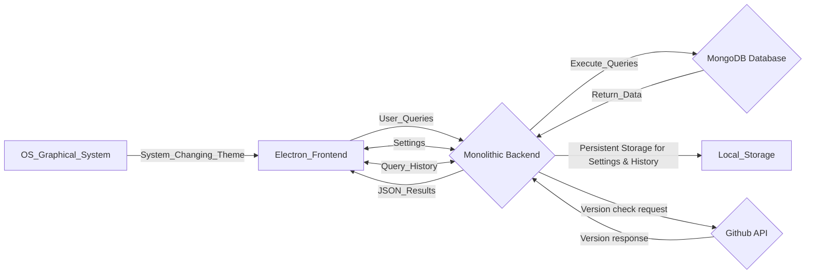

# System Name

Simple Electron MongoDB Query Tool

## Pipeline Dashboard

### Component Stages

| Component          | Commit Stage                                                                                                                                                                 | Acceptance Stage | Production Release Stage |
| ------------------ | ---------------------------------------------------------------------------------------------------------------------------------------------------------------------------- | ---------------- | ------------------------ |
| MongoDB Query Tool | [](https://github.com/vaisakhsasikumar/my-electron-app/actions/workflows/CommitStage.yml) | -                | -                        |

### System Stages

|        | Acceptance Stage                                                                                                                                                                               | Production Stage |
| ------ | ---------------------------------------------------------------------------------------------------------------------------------------------------------------------------------------------- | ---------------- |
| System | [](https://github.com/vaisakhsasikumar/electron-app-tests/actions/workflows/AcceptanceStage.yml) | -                |

## Description

A desktop application built with Electron that allows users to run a given MongoDB find queries and view the results in JSON format.

# Contributors

- [Vaisakh Sasikumar](https://github.com/vaisakhsasikumar)
- [Andrei Kim](https://github.com/andrei-kim-3tsoftwarelabs)
- [Vlad Lobanov](https://github.com/vladislavlobanov)
- [Hazel Ozmel](https://github.com/Hazel3t)
- [Ivan Martynov](https://github.com/MartynovIvan)

# Background Context

This project serves as a Test Driven Development (TDD) Sandbox, created as part of a TDD training program led by [Valentina Jemuović](https://www.linkedin.com/in/valentinajemuovic) through [Optivem Journal](https://journal.optivem.com/). In this environment, we are simulating legacy code to practice and implement TDD transformation techniques, which will prepare us to apply these methods to real-world projects. We selected a desktop application for this project to align closely with the types of applications our company produces and to ensure relevance to real-life scenarios.

# Use cases for the Simple Electron MongoDB Query Tool:

1. **Running MongoDB Queries**: Users can input and execute MongoDB `find` queries, enabling them to retrieve specific data from the MongoDB database.

2. **Viewing Results in JSON Format**: After executing a query, users can view the results in a structured JSON format, making it easy to read and understand the data returned.

3. **Configuring MongoDB Connection**: The application utilizes the MongoDB URI, Database, and Collection specified in the settings while running queries. This approach allows users to easily configure their connection details without needing to input connection strings each time they execute a query.

4. **Overviewing Execution History**: Users can invoke an "Advanced View" feature to see a simplified history of their queries and replies.
5. **Persisting Query History**: Users can have their previous queries saved in local storage, allowing them to easily access and rerun past queries without retyping.

6. **Managing Settings and Theme**: The application includes a settings menu that allows users to switch themes and MongoDB URI/Database/Collection. Settings are persisted in local storage in order to facilitate users not to enter them each time after the app has been restarted. Settings have default values, which are used when the app starts for the first time, and lately can be replaced anytime.

# External System(s)

**MongoDB**: The primary database system used for managing and querying data. MongoDB facilitates the storage of JSON-like documents with dynamic schemas, which is integral to the query tool's operation. [MongoDB Documentation](https://mongodb.com/docs/)

**SQLite**: Local database for local storage

**OS System theme**: The application retrieves the system theme setting from the operating system (OS) to apply the appropriate theme based on the user's preferred color scheme, which is determined by whether the OS is set to light or dark mode.

# System Architecture Style

The Simple Electron MongoDB Query Tool employs a **Monolithic Architecture Style**, combining both frontend and backend functionalities within a single application. This approach simplifies development and deployment, enabling users to execute MongoDB queries directly from the Electron interface without requiring a separate server.

# Architecture Diagram



# Repository and Branching Strategy

This project is hosted on GitHub, with source code managed and integrated with a CI/CD pipeline for automated build and testing.
We have mono github repo for the whole project. We create PRs and merge them to master branch from our personal repos or our branches from current repo.

# Deployment Model

The Simple Electron MongoDB Query Tool can be deployed as a native desktop application across various operating systems, including Windows, macOS, and Linux. Leveraging ElectronJS capabilities, the app can package web technologies into standalone executables, allowing users to easily install and run the application on their local machines without needing an additional server setup. This ensures a seamless experience for users while maintaining consistent functionality across platforms.

# Project Board

[Board](https://github.com/users/vaisakhsasikumar/projects/1/views/1)

# Proof-of-Concept Desktop Application using Electron


## Technologies

- **Electron** for desktop application development
- **MongoDB** for the database backend
- **Vite** for bundling JavaScript files
- **GitHub Actions** for continuous integration and deployment automation
- **Local Storage** Sqlite database

## Purpose

To provide hands-on experience with:

- Electron desktop app development
- MongoDB integration
- CI/CD automation with GitHub Actions

---

## How to Install the Application from .dmg installer

1. **Download** the `.dmg` from the [GitHub releases page](https://github.com/vaisakhsasikumar/my-electron-app/releases/latest).
2. **Open Terminal** and navigate to the download location:
   ```bash
   cd ~/Downloads
   ```
3. **Run** the command to remove security attributes:
   ```bash
   xattr -c "MongoDB-Query-Executor-Mac-x.x.x-Installer.dmg"
   ```
4. **Mount** the `.dmg` by double-clicking it.
5. **Drag** the app to your `Applications` folder.
6. **Launch** the application from `Applications`.

### **Important Note**

- **Installer Signing:** Currently, the installer is **not signed**, which is why it is needed to run the `xattr -c` command.

## Steps to Run the Application (from source code)

1. **Install dependencies**:

   ```bash
   npm install

   ```

2. **Build, Run and Deploy**:
   ```bash
   npm run build
   npm run dev
   ```

## Test Cases

[Acceptance Test Cases](https://github.com/vaisakhsasikumar/my-electron-app/blob/main/AcceptanceTestCases.md)

[E2E Test Cases](https://github.com/vaisakhsasikumar/my-electron-app/blob/main/E2ETestCases.md)

[Smoke Test Cases](https://github.com/vaisakhsasikumar/my-electron-app/blob/main/SmokeTestCases.md)

[External System Contract Test Cases](https://github.com/vaisakhsasikumar/my-electron-app/blob/main/ExternalSystemContractTestCases.md)

[Link to System Tests Repository](https://github.com/vaisakhsasikumar/electron-app-tests)

## Environments

| **Environment Name**       | **Purpose**                                 | **Location**                                                               | **Implementation**                          |
| -------------------------- | ------------------------------------------- | -------------------------------------------------------------------------- | ------------------------------------------- |
| **Commit Environment**     | Executes tests upon commit                  | [Code Repository](https://github.com/vaisakhsasikumar/my-electron-app/)    | Automated test pipelines via GitHub Actions |
| **Acceptance Environment** | Runs Automated Acceptance Tests             | [Tests Repository](https://github.com/vaisakhsasikumar/electron-app-tests) | Automated test pipelines                    |
| **E2E Environment**        | Executes E2E and Contract Tests             | [Tests Repository](https://github.com/vaisakhsasikumar/electron-app-tests) | Automated test suites in pipeline           |
| **UAT Environment**        | Runs Deployment and User Acceptance Testing | [Code Repository](https://github.com/vaisakhsasikumar/my-electron-app/)    | Manual trigger workflows via GitHub Actions |
| **Production Environment** | Hosts live system for end users             | [Code Repository](https://github.com/vaisakhsasikumar/my-electron-app/)    | Automated deployments via GitHub Actions    |
